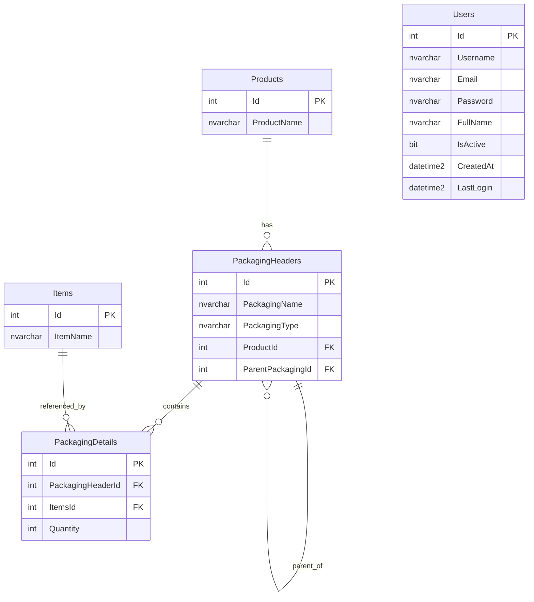

# Entity Relationship Diagram (ERD)

This document describes the database relationships for the product and hierarchical packaging schema.

## Mermaid ERD

## Relationship Summary

### Products -> PackagingHeaders
- One product can have many packaging headers.
- Foreign key: `PackagingHeaders.ProductId -> Products.Id`
- Meaning: every package belongs to a product.

### PackagingHeaders -> PackagingHeaders
- One packaging header can have many child packaging headers.
- Foreign key: `PackagingHeaders.ParentPackagingId -> PackagingHeaders.Id`
- Meaning: supports nested packaging.

### PackagingHeaders -> PackagingDetails
- One packaging header can have many packaging detail rows.
- Foreign key: `PackagingDetails.PackagingHeaderId -> PackagingHeaders.Id`
- Meaning: a package can directly contain multiple items.

### Items -> PackagingDetails
- One item can appear in many packaging detail rows.
- Foreign key: `PackagingDetails.ItemsId -> Items.Id`
- Meaning: the same item type can be used in multiple packages.

### Users
- `Users` is independent from the packaging hierarchy.
- It supports authentication and application user management.

## Notes

- `ParentPackagingId` is nullable for root packages.
- `PackagingHeaders` stores structure.
- `PackagingDetails` stores direct item membership.
- The hierarchy is recursive and can support multiple nesting levels.

## Example Hierarchy

Example product structure:

- Product
  - Master Box
    - Table Top Box
      - Table top
    - Table Legs Box
      - Table legs
    - Tools Packet
      - Screwdriver
      - Screws Packet
        - Screws

This is represented by:
- one row in `Products`
- multiple rows in `PackagingHeaders`
- multiple rows in `PackagingDetails`
- referenced rows in `Items`
